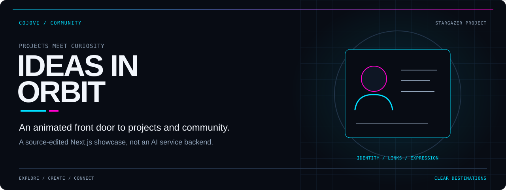
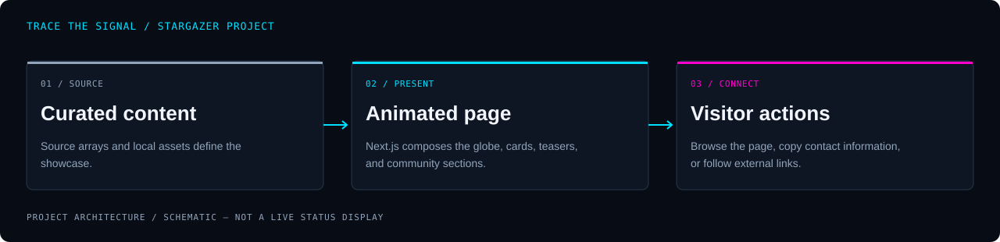

<!-- COJOVI / SIGNAL — Stargazer Project edition. Keep readme-assets/ with this file. -->
<!-- Presentation adapted for the cojovi fork; upstream identity retained. -->
<a name="top"></a>

<p align="center">
  
</p>

<h1 align="center">Stargazer Project</h1>

<p align="center">
  <strong>Explore the projects. Follow the curiosity. Find the community.</strong><br>
  A Next.js showcase with animated project cards, a 3D globe, and a community-focused landing page.
</p>

<p align="center">
  
</p>

<p align="center">
  <a href="#overview">Overview</a> ·
  <a href="#architecture">Architecture</a> ·
  <a href="#quickstart">Preparation</a> ·
  <a href="#configuration">Content</a> ·
  <a href="#validation">Validation</a> ·
  <a href="#security">Boundaries</a>
</p>

---

<a name="overview"></a>
## `> meet_stargazer`

**Stargazer Project is a community-themed adaptation of the JavaScript Mastery portfolio.** This repository, `cojovi/newStargazer`, turns the original portfolio sections into an introduction to projects, technology interests, blog teasers, and community participation.

The presentation combines **Next.js 14.1.4, React 18, TypeScript, Tailwind CSS, Three.js, and Framer Motion**. Its content is maintained in source, not through an admin dashboard.

| Explore | Experience | Connect |
| :--- | :--- | :--- |
| Browse a bento introduction, project cards, and blog teasers. | See spotlight text, an animated globe, moving cards, and canvas reveals. | Follow separately hosted destinations or copy the configured contact address. |

> [!IMPORTANT]
> **This is a showcase, not an AI platform or community backend.** It does not implement the products described on its cards, host a blog, manage memberships, or provide a working chat service. Several navigation and setup details need review before a new deployment.

<a name="architecture"></a>
## `> trace_the_page`

<p align="center">
  
</p>

```text
Source content + local assets
            ↓
Next.js App Router
├─ root layout + theme provider
└─ landing page
   ├─ hero + bento grid
   ├─ project + testimonial cards
   └─ blog teasers + approach + footer
            ↓
Visitor navigation / contact-copy interaction
```

[app/page.tsx](app/page.tsx) composes the landing page. [data/index.ts](data/index.ts) supplies the shared navigation and card arrays, while several components also contain their own copy and destinations.

The globe and canvas effects are visual components, not live operational data. The `workExperience` array now supplies **blog teasers**, despite its inherited identifier. The footer links to an external community rather than creating one inside the application.

Sentry is a separate telemetry integration: client, server, and edge configuration files initialize it, and [next.config.mjs](next.config.mjs) wraps the Next build with Sentry configuration. It is not needed to explain the page's content model.

<a name="quickstart"></a>
## `> prepare_a_preview`

**Prerequisites:** Git, Node.js, and npm compatible with the pinned Next.js release. [package.json](package.json) has no Node engine declaration; the package name remains **`portfolio`**.

### 1. Get this fork

```bash
git clone --branch main https://github.com/cojovi/newStargazer.git
cd newStargazer
```

### 2. Review the integration and layout defaults

Before running a personal copy:

1. Review the Sentry configuration files and build wrapper. Remove or replace inherited telemetry destinations and project settings with ones you control.
2. Review [app/Chatbot.tsx](app/Chatbot.tsx). It is not mounted by the current page/layout and includes a credential-like literal; do not enable it unchanged.
3. Inspect [app/layout.tsx](app/layout.tsx): it currently returns a fragment containing `head` and `body`, but **no required root `html` element**. Correct that in your own development work before expecting a healthy Next.js preview.
4. Replace contact data, external destinations, and any presentation copy you do not intend to publish.

### 3. Install and preview after those checks

```bash
npm install
npm run dev -- --hostname 127.0.0.1
```

Use **http://127.0.0.1:3000**, or the address Next prints if the port changes. These are the repository's development commands, not a claim that the current revision starts successfully.

There is no tracked environment template or application-specific `.env` loader. Integration settings are currently embedded in source; adding an environment variable alone does not replace them.

<a name="configuration"></a>
## `> shape_the_content`

| Change | Source of truth |
| :--- | :--- |
| Hero introduction and primary scroll action | [Hero.tsx](components/Hero.tsx) |
| Navigation, bento, projects, quotes, blog teasers | [data/index.ts](data/index.ts) |
| Project-card destination | [RecentProjects.tsx](components/RecentProjects.tsx) |
| Clipboard contact and decorative stack labels | [BentoGrid.tsx](components/ui/BentoGrid.tsx) |
| Community call to action and footer | [Footer.tsx](components/Footer.tsx) |
| Hover-reveal approach cards | [Approach.tsx](components/Approach.tsx) |
| Page title, description, font, and theme defaults | [app/layout.tsx](app/layout.tsx) |
| Colors, motion utilities, and global styles | [tailwind.config.ts](tailwind.config.ts) and [globals.css](app/globals.css) |

The theme provider defaults to dark mode and enables system-theme support. The Inter font is configured through `next/font/google`; account for font-fetch requirements when preparing a build environment.

Keep the existing data identifiers when editing content. Renaming `workExperience`, for example, requires updating the component import; changing the displayed copy does not.

<a name="usage"></a>
## `> follow_the_links`

The intended experience is one scrolling page: introduction, projects, community quotes, blog teasers, approach cards, then contact.

- **About and Contact:** point to sections with `about` and `contact` IDs.
- **Projects:** navigation points to `#projects`, but the current project component does not define that ID.
- **Project cards:** the component supplies one shared destination to every `PinContainer`; the individual `projects[].link` values are not used for navigation.
- **Blog teasers:** display source-edited text and images, not fetched articles or internal article routes.
- **Social icons:** the footer renders decorative icon containers without link destinations.
- **Contact copy:** writes a source-configured address to the clipboard; it does not send email.

Treat these as review points for adapting the showcase, not instructions to visit or validate someone else's live services.

<a name="validation"></a>
## `> check_the_showcase`

After resolving the preparation items, maintainers can use the defined scripts:

```bash
npm run lint
npm run build
npm run start -- --hostname 127.0.0.1
```

`start` serves an existing production build; it is not a substitute for `build`. There is no test script or tracked automated test suite in this revision.

**Application builds and tests were not run for this documentation work.**

- [ ] Restore the required root layout structure and verify page startup.
- [ ] Confirm telemetry ownership and intended data collection before loading a preview.
- [ ] Make each project card open its intended destination.
- [ ] Add or revise the missing Projects anchor.
- [ ] Verify contact-copy behavior and all community links with approved values.
- [ ] Review quote content as parody/presentation copy, not verified endorsements.
- [ ] Check case-sensitive asset references, including the company wordmark paths.
- [ ] Test keyboard access, touch interactions, reduced motion, and small screens.
- [ ] Run lint and build in a controlled environment before deploying.

<a name="source-map"></a>
## `> explore_the_source`

| Path | Responsibility |
| :--- | :--- |
| [app/](app/) | App Router entry, layout, theme provider, and Sentry examples. |
| [components/](components/) | Landing-page sections. |
| [components/ui/](components/ui/) | Globe, canvas, bento, navigation, and animation primitives. |
| [data/](data/) | Content arrays, globe data, and confetti animation data. |
| [public/](public/) | Static artwork and icons used by the application. |
| [next.config.mjs](next.config.mjs) | Next configuration and Sentry build integration. |
| [package.json](package.json) | Actual package identity, dependencies, and commands. |

The tracked `app/layout copy.tsx` and `app/globals copy.css` are alternate files, not the active root layout and stylesheet. No GitHub Actions workflow is tracked at the reviewed revision.

<a name="security"></a>
## `> keep_clear_edges`

- **Credentials:** treat the literal in the unused chatbot component as exposed if it was ever valid. Revoke or rotate it; do not copy it into browser-delivered source or public reports.
- **Telemetry:** Sentry destinations are already configured. Review tracing, replay collection, source-map upload behavior, and project ownership before running or building a copy.
- **Intentional errors:** the Sentry example page and API route are diagnostics. The example API throws an error by design; it is not an application service.
- **Deployment:** `npm run deploy` invokes `vercel --prod`. This is a production action, not a local verification step.
- **Private settings:** `.gitignore` covers `.env*.local`, not every possible environment filename. Keep secrets out of tracked files.

### Upstream and license

This repository is a fork of **[adrianhajdin/portfolio](https://github.com/adrianhajdin/portfolio)**, the JavaScript Mastery Next.js portfolio tutorial. The Stargazer content and this presentation belong to the fork's adaptation; the original scaffold is not represented as a new, wholly independent implementation.

**No root license file was found in the reviewed revision.** Preserve upstream attribution and applicable third-party notices; clarify reuse rights rather than assuming a license from public availability. Website footer wording is not a substitute for license terms.

---

<p align="center">
  
</p>

<p align="center">
  <strong>Curious ideas. Visible work. Clear destinations.</strong><br>
  <sub>A <a href="https://github.com/cojovi">Cody / cojovi</a> fork · <a href="https://cojovi.com">cojovi.com</a><br>
  Upstream: adrianhajdin/portfolio · Presented in COJOVI / SIGNAL.</sub>
</p>

<p align="center"><a href="#top">↑ Back to the signal</a></p>
